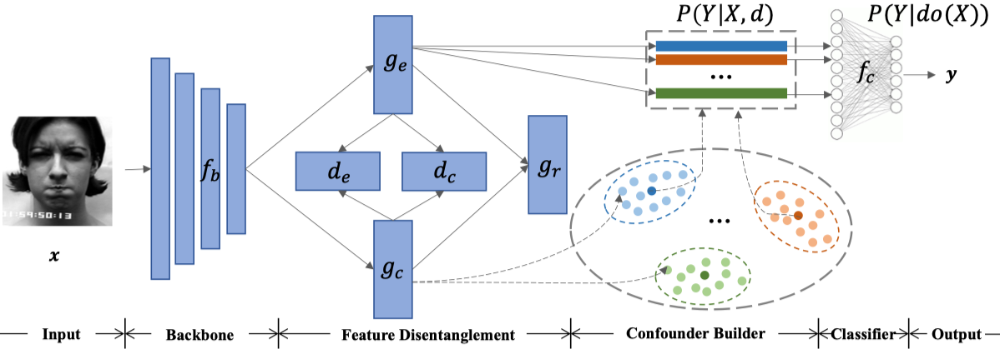

# Towards Unbiased Visual Emotion Recognition via Causal Intervention

Official PyTorch implementation of [ACM Multimedia 2022] *Towards Unbiased Visual Emotion Recognition via Causal Intervention* by [Yuedong Chen](https://donydchen.github.io/), [Xu Yang](https://scholar.google.com.sg/citations?user=SqdxMH0AAAAJ), [Tat-Jen Cham](https://personal.ntu.edu.sg/astjcham/) and [Jianfei Cai](https://jianfei-cai.github.io/).

<a href="https://arxiv.org/abs/2107.12096"></a> 
<a href="https://opensource.org/licenses/MIT"></a> 

## Abstract

Although much progress has been made in visual emotion recognition, researchers have realized that modern deep networks tend to exploit dataset characteristics to learn spurious statistical associations between the input and the target. Such dataset characteristics are usually treated as dataset bias, which damages the robustness and generalization performance of these recognition systems. In this work, we scrutinize this problem from the perspective of causal inference, where such dataset characteristic is termed as a **confounder** which misleads the system to learn the spurious correlation. To alleviate the negative effects brought by the dataset bias, we propose a novel **Interventional Emotion Recognition Network (IERN)** to achieve the backdoor adjustment, which is one fundamental deconfounding technique in causal inference. Specifically, IERN starts by disentangling the dataset-related context feature from the actual emotion feature, where the former forms the confounder. The emotion feature will then be forced to see each confounder stratum equally before being fed into the classifier. A series of designed tests validate the efficacy of IERN, and experiments on three emotion benchmarks demonstrate that IERN outperforms state-of-the-art approaches for unbiased visual emotion recognition.



----

## Installation

### Setup Environment

We recommend to use [Anaconda](https://www.anaconda.com) to create the running environment for the project, and all related dependencies are provided in `environment/iern.yml`, kindly run

```bash
git clone https://github.com/donydchen/causal_emotion.git
cd causal_emotion
conda env create -f environment/iern.yml
conda activate iern
```

**Note**: The above environment contains *PyTorch 1.4 with CUDA 10*, if it does not work on your machine, please refer to [environment/README.md](https://github.com/donydchen/causal_emotion/blob/main/environment/README.md) for manual installation and trouble shootings.

### Download Pretrained Weights

Download the pretrained models from [here](https://drive.google.com/drive/folders/1TCb6oYzLSVKHs040K09y-BcE-ER9VOuU), and save them to `pretrained_models/`.


## Dataset Preparation

NOTE: All dataset preprocessing scripts are mainly *for reference* only. Generally they should work out fine, but you are expected to quickly go through them, and uncomment some functions (if needed) to complete the preprocessings step-by-step.

* Download the CK+, MMI and OuluCASIA datasets, and store them to `datasets/`.
* Download the face and landmark detector from [here](https://drive.google.com/drive/folders/1IjJTmrEMgVN1ei9weku1p1o6UeT1klc0), and save them to `datasets/face_process/`.
* Check out the scripts `ckplus.py, mmi.py, oulucasia.py` in `dataset/face_process` for how to extract and align the face. 
* Refer to `combine_labels.py` in `dataset/face_process` for combining all labels and dumping them into one file.
* That's it, you are good to go. Your `datasets` should have the following structures at the end.

```bash
datasets/
    |__ face_process/
    |__ MixBasic/
        |__ CKPlus/
            |__ images/
        |__ MMI/
            |__ images/
        |__ OuluCASIA/
            |__ images/
        |__ emotion_labels.pkl
        |__ test_ids_bias90v1.csv
        |__ test_ids_bias90v2.csv
        |__ ...
        |__ train_ids_bias100v3.csv
```


## Experiments

Note that we design a *three-folds* cross validation setting for the Mix-Dataset experiments. Training and testing configurations are provided in `datasets/*.csv`, kindly refer to *Section 4.1 Dataset settings* in the paper for more details.

Besides, `bias100` refers to the designed *o.o.d* setting (results reported in Table 2 in the paper), while `bias90` refers to the modified setting (results reported in Table 3 in the paper). `v1` refers to Fold1, and so on.

### Inference

To test IERN with the pretrained_models downloaded above, kindly run the following command.

```bash
python test.py \
--dataroot=datasets/MixBasic \
--checkpoints_dir=pretrained_models/mixbasic/fold_bias100v1 \
--epoch=160 \
--test_conf_name=test_ids_bias100v1.csv
```

You can also change the checkpoints path and configuration path to test on other folds.

### Training

To train IERN, use the following command,

```bash
python train.py \
--dataroot=datasets/MixBasic \
--batch_size=8 \
--train_conf_name=train_ids_bias100v1.csv \
--test_conf_name=test_ids_bias100v1.csv
```

You can also tune some training options, so as to get better performance, *e.g.*, `lr_policy, n_epochs_warmup, lr_policy_after, n_epochs, n_epochs_decay`, *etc*. Kindly run `python train.py --help` to check out more tuning options.

## Misc

### Citations

If you use this project for your research, please cite our paper.

```bibtex
@article{chen2021towards,
  title={Towards Unbiased Visual Emotion Recognition via Causal Intervention},
  author={Chen, Yuedong and Yang, Xu and Cham, Tat-Jen and Cai, Jianfei},
  journal={arXiv preprint arXiv:2107.12096},
  year={2021}
}
```

### Acknowledgments

Our implementation borrowed the code structure provided by [pytorch-CycleGAN-and-pix2pix](https://github.com/junyanz/pytorch-CycleGAN-and-pix2pix), we would like to thank them for releasing such a great project.
